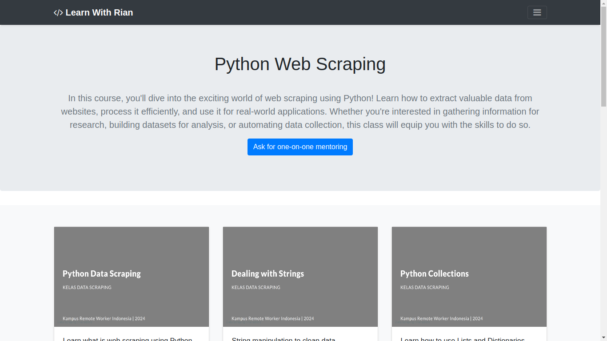
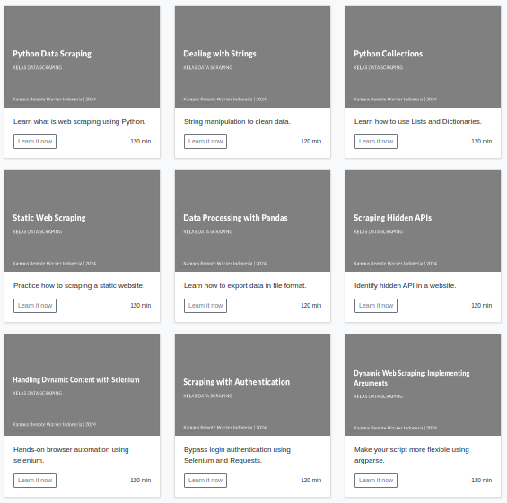

# Learn With Rian Aditro

Welcome to the Learn With Rian Aditro repository! This is a web-based educational platform designed to provide users with a variety of programming courses. Our goal is to make learning accessible and enjoyable for everyone, regardless of their skill level.

## Current Course

### Python Web Scraping

- **Description**: Dive into the world of web scraping using Python! This course covers essential techniques for extracting data from websites, processing it, and applying it to real-world applications.
- **What You Will Learn**:
  - Core concepts of web scraping
  - Using libraries like BeautifulSoup and Requests
  - Scraping dynamic content with Selenium
  - Ethical scraping practices
  - Data processing techniques
  - Many more..

- **What Inside Module**:
  - Explanation each topic and sub topic
  - Class activity
  - Homework
  - Additional resource
  - Resource to more advanced topic

## Upcoming Courses

We plan to expand our offerings with the following courses:
- **Python from Zero**: A comprehensive introduction to Python for beginners.
- **Web Development**: Build responsive websites using HTML, CSS, and JavaScript.
- **Machine Learning**: Understand the basics of machine learning and how to implement algorithms with Python.

## Technology Stack

This platform is developed using **Flask**, a lightweight web framework for Python. Flask allows us to build a robust and flexible web application.

## Contribution

We welcome contributions from the community! If you have ideas, feedback, or want to contribute to the project, please reach out to us. You can contact me at [rianaditro@gmail.com](mailto:rianaditro@gmail.com).

### How to Contribute
1. Fork the repository.
2. Create a new branch for your feature or bug fix.
3. Make your changes and commit them.
4. Push your branch and create a pull request.

## License

This project is open source and available under the [MIT License](LICENSE).

## Contact

For questions, suggestions, or collaboration inquiries, please feel free to contact me at [rianaditro@gmail.com](mailto:rianaditro@gmail.com).

---

Thank you for checking out our Learn With Rian Aditro! We hope you find it valuable and informative.
